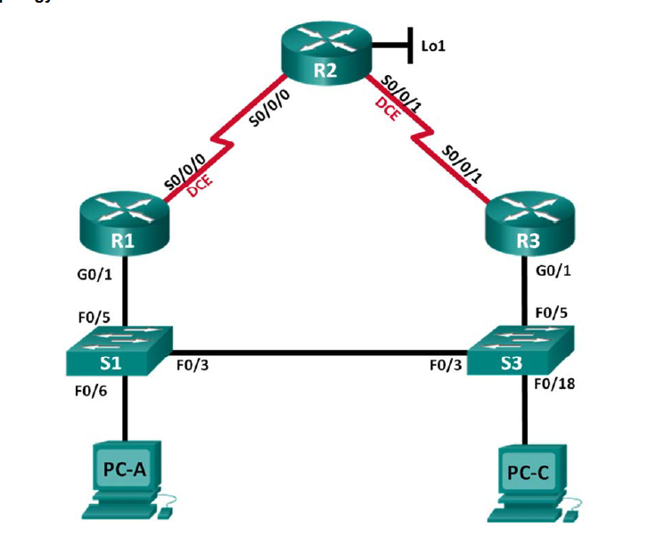
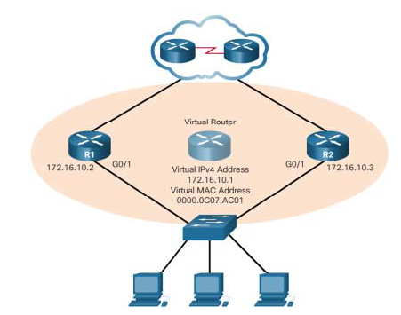
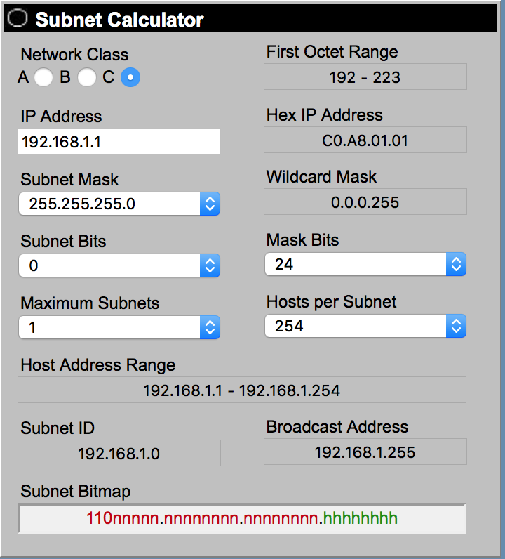

# router

## configure basis settings

```text
Enable
Configure terminal
no ip domain-lookup
hostname R1
service password-encryption
enable secret admin
banner motd #
Unauthorized access is strictly prohibited. #
Line con 0
password admin
login
logging synchronous
line vty 0 4
password admin
login
```

> Password: admin

## Configure ip adresses

```text
Configure terminal
interface <interface>
ip address <ip address> <subnet>
no shutdown
exit
```

> Shutdown or no shutdown disabeld or enabelde the port
>
> show ip interface brief

### interfaces

Serial connection 

```text
interface S0/0/0
```

Gigabit eternet connection

```text
interface G0/0
```

Loopback interface

```text
interface loopback 0
```

## RIP protocol

het rip protocol laat connenctie maken van router naar router

```text
Configure terminal
router rip
version 2
network 10.0.0.0
no auto-summary
exit
```

> network kies je het grootste ip address in gebruik bv 10.0.0.0  
> no aut-summery wordt gebruikt om niet klassevol te moeten werken.

you will need to configure the following code if you need to go to a extranet

```text
redistribute static 
default-information originate
```


## DHCP protocol

Het DHCP protocol laat ip addressen automatich toekennen.

```text
Configure terminal
ip dhcp excluded-address 10.0.3.254
ip dhcp excluded-address 10.0.4.250 10.0.4.254
ip dhcp pool vlan10
network 10.0.0.0 255.225.252.0
default-router 10.0.3.254
exit
ip dhcp pool vlan20
network 10.0.4.0 255.225.255.0
default-router 10.0.4.254
exit
```

> exlcude-adresses are adresses that will not be used for dhcp

an ip helper is confiugered for  sending the ip adresses trough

```text
Configure terminal
interface g0/0.10
ip helper-address 10.0.5.34
exit
```

## ACL

```text
Configure terminal
Access-list 1permit 10.0.5.0 0.0.0.31
Access-list 1 deny any
interface g0/0.10
ip access-group 1 out
Access-list 2 deny 10.0.0.0 0.0.3.255   
Access-list 2 permit any
interface g0/0.20
ip access-group 2 out
```

> show access-list

## NAT

Network Address Translation

```text
Configure terminal
access-list 1 permit 10.0.0.0 0.0.3.255
access-list 1 permit 10.0.4.0 0.0.0.255
access-list 1 permit 10.0.5.0 0.0.0.31
ip nat pool publicAcces 18.0.0.1 18.0.0.1 netmask 255.0.0.0
ip nat inside source list 1 pool publicAcces overload
interface g0/0
ip nat outside
interface serial0/0/0
ip nat inside
exit
interface serial0/0/1
ip nat inside 
exit
```

> add your ip netten with their wildcard to the accaslist.  
> configure your public adres with there subnet.
>
> `publicAcces` is a variable

**`show ip nat translations`**


## CCNA3

## HSRP protocol

Hot Standby Router Protocol





In this step, you will configure HSRP and change the default gateway address on PC-A, PC-C, S1, and S2 to the virtual IP address for HSRP. R1 becomes the active router via configuration of the HSRP priority command.

c. Verify HSRP by issuing the show standby command on R1

```text
interface g0/1
standby version 2
standby 1 ip 192.168.1.254
standby 1 priority 150
standby 1 preempt

```

R3

```text
interface g0/1
standby version 2
standby 1 ip 192.168.1.254
```



the virutal ip addres is an ip addres that inlcude all the ip address that are yoused. Mostley its broadcast -1

> show standby
>
> show standby brief


