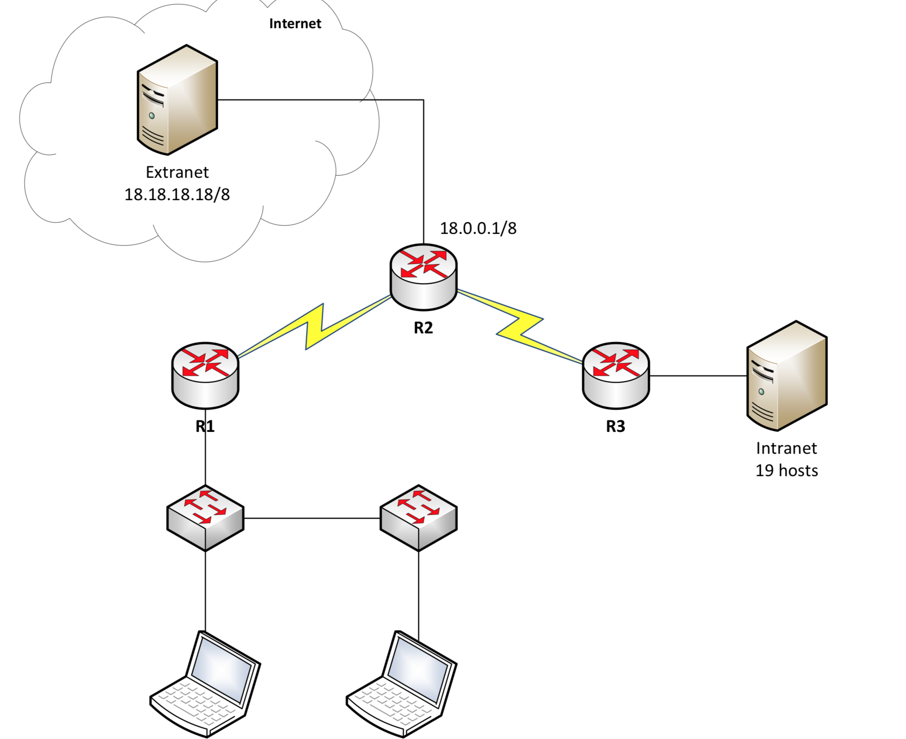
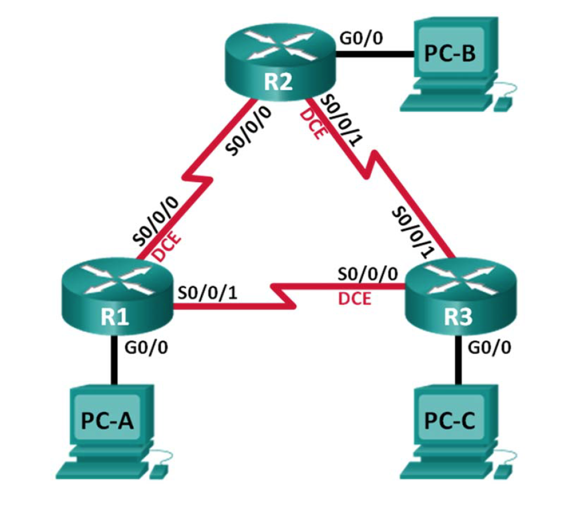
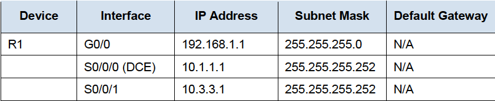

# router

## configure basis settings

```text
Enable
Configure terminal
no ip domain-lookup
hostname R1
service password-encryption
enable secret admin
banner motd #
Unauthorized access is strictly prohibited. #
Line con 0
password admin
login
logging synchronous
line vty 0 4
password admin
login
```

> Password: admin

## Configure ip adresses

```text
Configure terminal
interface <interface>
ip address <ip address> <subnet>
no shutdown
exit
```

> Shutdown or no shutdown disabeld or enabelde the port
>
> show ip interface brief

### interfaces

Serial connection 

```text
interface S0/0/0
```

Gigabit eternet connection

```text
interface G0/0
```

Loopback interface

```text
interface loopback 0
```

## RIP protocol

het rip protocol laat connenctie maken van router naar router

```text
Configure terminal
router rip
version 2
network 10.0.0.0
no auto-summary
exit
```

> network kies je het grootste ip address in gebruik bv 10.0.0.0  
> no aut-summery wordt gebruikt om niet klassevol te moeten werken.

you will need to configure the following code if you need to go to a extranet

```text
redistribute static 
default-information originate
```



## DHCP protocol

Het DHCP protocol laat ip addressen automatich toekennen.

```text
Configure terminal
ip dhcp excluded-address 10.0.3.254
ip dhcp excluded-address 10.0.4.250 10.0.4.254
ip dhcp pool vlan10
network 10.0.0.0 255.225.252.0
default-router 10.0.3.254
exit
ip dhcp pool vlan20
network 10.0.4.0 255.225.255.0
default-router 10.0.4.254
exit
```

> exlcude-adresses are adresses that will not be used for dhcp

an ip helper is confiugered for  sending the ip adresses trough

```text
Configure terminal
interface g0/0.10
ip helper-address 10.0.5.34
exit
```

## ACL

```text
Configure terminal
Access-list 1permit 10.0.5.0 0.0.0.31
Access-list 1 deny any
interface g0/0.10
ip access-group 1 out
Access-list 2 deny 10.0.0.0 0.0.3.255   
Access-list 2 permit any
interface g0/0.20
ip access-group 2 out
```

> show access-list

## NAT

Network Address Translation

```text
Configure terminal
access-list 1 permit 10.0.0.0 0.0.3.255
access-list 1 permit 10.0.4.0 0.0.0.255
access-list 1 permit 10.0.5.0 0.0.0.31
ip nat pool publicAcces 18.0.0.1 18.0.0.1 netmask 255.0.0.0
ip nat inside source list 1 pool publicAcces overload
interface g0/0
ip nat outside
interface serial0/0/0
ip nat inside
exit
interface serial0/0/1
ip nat inside 
exit
```

> add your ip netten with their wildcard to the accaslist.  
> configure your public adres with there subnet.
>
> `publicAcces` is a variable

**`show ip nat translations`**


## CCNA3

## HSRP protocol

Hot Standby Router Protocol


In this step, you will configure HSRP and change the default gateway address on PC-A, PC-C, S1, and S2 to the virtual IP address for HSRP. R1 becomes the active router via configuration of the HSRP priority command.

R1

```text
interface g0/1
standby version 2
standby 1 ip <virtual ip>
standby 1 priority 150
standby 1 preempt

```

R2

```text
interface g0/1
standby version 2
standby 1 ip <virtual ip>
```


> show standby
>
> show standby brief

## EIGRP



The routers should be able to ping one another, and each PC should be able to ping its default gateway. The PCs will **not** be able to ping other PCs until EIGRP routing is configured. Verify and troubleshoot if necessary.

Advertise the directly connected networks on R1 using the wildcard mask.



```text
router eigrp 10
network 192.168.1.0 0.0.0.255
network 10.1.1.0 0.0.0.3
network 10.3.3.0 0.0.0.3
```

do the same for al routers

> show ip eigrp neighbors  
> show ip route eigrp

### Bandwith

on R1

```text
interface s0/0/0
bandwidth 2000
interface s0/0/1
bandwidth 64
```

on r2

```text
interface s0/0/0
bandwidth 2000
interface s0/0/1
bandwidth 2000
```

on r3

```text
interface s0/0/0
bandwidth 64
interface s0/0/1
bandwidth 2000
```

> show interface s0/0/0

### Passieve interface

```text
router eigrp 10
passive-interface g0/0
```

> show ip protocols

## OSPF

Open Shortest Path First \(OSPF\) is a link-state routing protocol for IP networks

### change router ID assignments

```text
Router ospf 1
router-id 1.1.1.1
end
clear ip ospf process
yes
```

> After the router completes the reload process, issue the `show ip protocols` command to view the new router ID.

> Issue the `show ip ospf neighbor` command to display the router ID changes for the neighboring routers.

### chaning router id using loopback addresses

```text
interface lo0
ip address 1.1.1.1 255.255.255.255
end
clear ip ospf process
yes
```

### Configure and verify OSPF Routing


R1

```text
Router ospf 1
network 192.168.1.0 0.0.0.255 area 0
network 192.168.0.0 0.0.0.3 area 0
network 10.0.0.0 0.255.255.255 area 10

passive-interface G0/1
```

> door int G0/1 passive te zetten zal 3.3.3.3 niet als neigbour verschijnen

R2

```text
Router ospf 1
network 192.168.0.0 0.0.0.3 area 0
network 192.168.0.4 0.0.0.3 area 0

default-information originate
exit
ip route 0.0.0.0 0.0.0.0 Loopback 0
```

R3

```text
Router ospf 1
network 192.168.1.0 0.0.0.255 area 0
network 192.168.0.4 0.0.0.3 area 0
network 172.16.0.0 0.0.255.255.255 area 20
```

> network kies je het grootste ip address in gebruik bv 10.0.0.0  
> Erna gebruik je het wildcard mask
>
> Issue the `show ip ospf neighbor` command to verify that each router lists the other routers in thenetwork as neighbors.

> Issue the `show ip route` command to verify that all networks display in the routing table on all routers.
>
> The `show ip protocols` command is a quick way to verify vital OSPF configuration information. This information includes the OSPF process ID, the router ID, networks the router is advertising, the neighbors the router is receiving updates from, and the default administrative distance, which is 110 for OSPF.
>
> Use the `show ip ospf` command to examine the OSPF process ID and router ID. This command displays the OSPF area information, as well as the last time the SPF algorithm was calculated.
>
> Issue the `show ip ospf interface brief` command to display a summary of OSPF-enabled interfaces.
>
> For a more detailed list of every OSPF-enabled interface, issue the `show ip ospf interface` command.

## multi-area OSPF

R1

```text
Router ospf 1
network 10.0.0.0 0.255.255.255 area 10
area 10 range 10.0.0.0 255.0.0.0 
```

R3

```text
Router ospf 1
network 172.16.0.0 0.0.255.255.255 area 20
area 20 range 172.16.0.0 255.255.0.0
```

## Authentication

op iedere interface

```text
Interface serial0/0/0
ip ospf authentication meddage-digest
ip ospf message-digest-key 1 md5 cisco
```

## banbreedte, mo da mag wel nie van cordemans.

```text
interface s0/0/0
bandwith 128
```

## Configure OSPF passive interfaces

```text
router ospf 1
passive-interface g0/0

```


