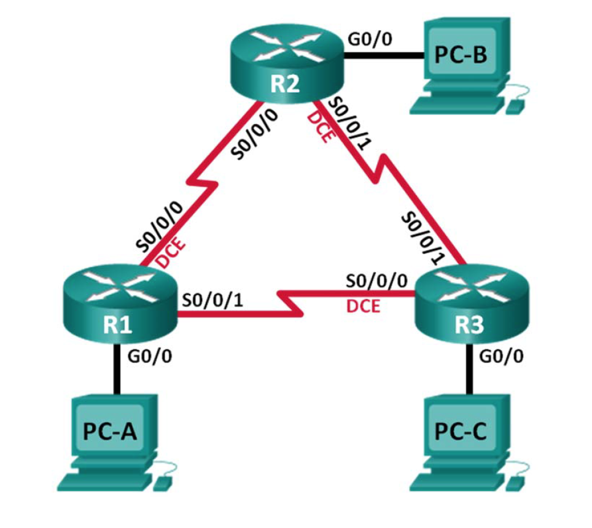
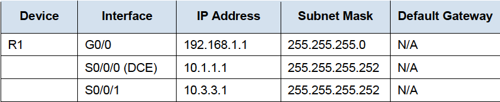

# EIGRP


## EIGRP



The routers should be able to ping one another, and each PC should be able to ping its default gateway. The PCs will **not** be able to ping other PCs until EIGRP routing is configured. Verify and troubleshoot if necessary.

Advertise the directly connected networks on R1 using the wildcard mask.



```text
router eigrp 10
network 192.168.1.0 0.0.0.255
network 10.1.1.0 0.0.0.3
network 10.3.3.0 0.0.0.3
```

do the same for al routers

> show ip eigrp neighbors  
> show ip route eigrp

### Bandwith

on R1

```text
interface s0/0/0
bandwidth 2000
interface s0/0/1
bandwidth 64
```

on r2

```text
interface s0/0/0
bandwidth 2000
interface s0/0/1
bandwidth 2000
```

on r3

```text
interface s0/0/0
bandwidth 64
interface s0/0/1
bandwidth 2000
```

> show interface s0/0/0

### Passieve interface

```text
router eigrp 10
passive-interface g0/0
```

> show ip protocols

