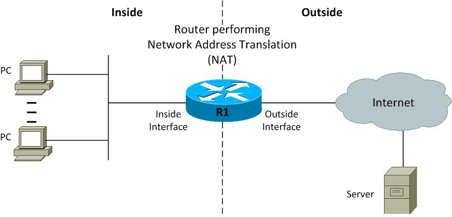

# NAT

> [http://packetlife.net/media/library/32/NAT.pdf](http://packetlife.net/media/library/32/NAT.pdf)



## NAT

Network Address Translation

```text
Configure terminal
access-list 1 permit 10.0.0.0 0.0.3.255
access-list 1 permit 10.0.4.0 0.0.0.255
access-list 1 permit 10.0.5.0 0.0.0.31
ip nat pool publicAcces 18.0.0.1 18.0.0.1 netmask 255.0.0.0
ip nat inside source list 1 pool publicAcces overload
interface g0/0
ip nat outside
interface serial0/0/0
ip nat inside
exit
interface serial0/0/1
ip nat inside 
exit
```

> add your ip netten with their wildcard to the accaslist.  
> configure your public adres with there subnet.
>
> `publicAcces` is a variable

**`show ip nat translations`**

## Troubleshooting

```text
show ip nat translations [verbose]
show ip nat statistics
clear ip nat translations
```

