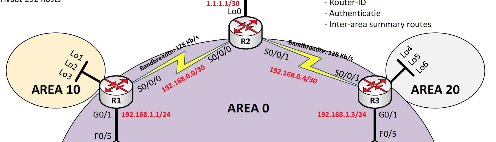

# OSPF

### change router ID assignments

```text
Router ospf 1
router-id 1.1.1.1
end
clear ip ospf process
yes
```

> After the router completes the reload process, issue the `show ip protocols` command to view the new router ID.

> Issue the `show ip ospf neighbor` command to display the router ID changes for the neighboring routers.

### chaning router id using loopback addresses

```text
interface lo0
ip address 1.1.1.1 255.255.255.255
end
clear ip ospf process
yes
```

### Configure and verify OSPF Routing



R1

```text
Router ospf 1
network 192.168.1.0 0.0.0.255 area 0
network 192.168.0.0 0.0.0.3 area 0
network 10.0.0.0 0.255.255.255 area 10

passive-interface G0/1
```

> door int G0/1 passive te zetten zal 3.3.3.3 niet als neigbour verschijnen

R2

```text
Router ospf 1
network 192.168.0.0 0.0.0.3 area 0
network 192.168.0.4 0.0.0.3 area 0

default-information originate
exit
ip route 0.0.0.0 0.0.0.0 Loopback 0
```

R3

```text
Router ospf 1
network 192.168.1.0 0.0.0.255 area 0
network 192.168.0.4 0.0.0.3 area 0
network 172.16.0.0 0.0.255.255.255 area 20
```

> network kies je het grootste ip address in gebruik bv 10.0.0.0  
> Erna gebruik je het wildcard mask
>
> Issue the `show ip ospf neighbor` command to verify that each router lists the other routers in thenetwork as neighbors.

> Issue the `show ip route` command to verify that all networks display in the routing table on all routers.
>
> The `show ip protocols` command is a quick way to verify vital OSPF configuration information. This information includes the OSPF process ID, the router ID, networks the router is advertising, the neighbors the router is receiving updates from, and the default administrative distance, which is 110 for OSPF.
>
> Use the `show ip ospf` command to examine the OSPF process ID and router ID. This command displays the OSPF area information, as well as the last time the SPF algorithm was calculated.
>
> Issue the `show ip ospf interface brief` command to display a summary of OSPF-enabled interfaces.
>
> For a more detailed list of every OSPF-enabled interface, issue the `show ip ospf interface` command.

## multi-area OSPF

R1

```text
Router ospf 1
network 10.0.0.0 0.255.255.255 area 10
area 10 range 10.0.0.0 255.0.0.0 
```

R3

```text
Router ospf 1
network 172.16.0.0 0.0.255.255.255 area 20
area 20 range 172.16.0.0 255.255.0.0
```

## Authentication

op iedere interface

```text
Interface serial0/0/0
ip ospf authentication meddage-digest
ip ospf message-digest-key 1 md5 cisco
```

## Configure OSPF passive interfaces

```text
router ospf 1
passive-interface g0/0

```


