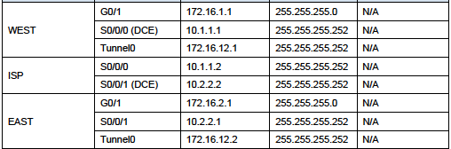

# Point-to-Point GRE VPN Tunnel


[https://community.cisco.com/t5/networking-documents/how-to-configure-a-gre-tunnel/ta-p/3131970](https://community.cisco.com/t5/networking-documents/how-to-configure-a-gre-tunnel/ta-p/3131970)


Tunneling provides a mechanism to transport packets of one protocol within another protocol. The protocol that is carried is called as the passenger protocol, and the protocol that is used for carrying the passenger protocol is called as the transport protocol. Generic Routing Encapsulation \(GRE\) is one of the available tunneling mechanisms which uses IP as the transport protocol and can be used for carrying many different passenger protocols. The tunnels behave as virtual point-to-point links that have two endpoints identified by the tunnel source and tunnel destination addresses at each endpoint.

The below diagram shows encapsulation process of GRE packet as it traversers the router and enters the tunnel interface:


## Configration




### Configure default routes to the ISP router.

```text
WEST(config)# ip route 0.0.0.0 0.0.0.0 <IP ADD S0/0/0>
WEST(config)# ip route 0.0.0.0 0.0.0.0 10.1.1.2

EAST(config)# ip route 0.0.0.0 0.0.0.0 <IP ADD S0/0/1>
EAST(config)# ip route 0.0.0.0 0.0.0.0 10.2.2.2
```

## Configure the GRE tunnel interface.

```text
WEST(config)# interface tunnel 0

WEST(config-if)# ip address 172.16.12.1 255.255.255.252

WEST(config-if)# tunnel source s0/0/0

WEST(config-if)# tunnel destination 10.2.2.1
```

```text
EAST(config)# interface tunnel 0

EAST(config-if)# ip address 172.16.12.2 255.255.255.252

EAST(config-if)# tunnel source 10.2.2.1
EAST(config-if)# tunnel destination 10.1.1.1
```

### Verify that the GRE tunnel is functional.

```text
show ip interface brief
pingen naar ip addresses (PC en routers)
show ip route
```

## Enable Routing over the GRE Tunnel

### Configure OSPF routing for area 0 over the tunnel.

```text
R1(config)# router ospf 1
R1(config-router)# network 172.16.1.0 0.0.0.255 area 0 
R1(config-router)# network 172.16.12.0 0.0.0.3 area 0
```

```text
R2(config)# router ospf 1
R2(config-router)# network 172.16.2.0 0.0.0.255 area 0 
R2(config-router)# network 172.16.12.0 0.0.0.3 area 0
```

