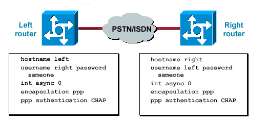

# PPP

## CHAP



op beide routers

```text
interface s0/0/0
encapsulation ppp
debug ppp negotiation
debug ppp packet
encapsulation ppp
end
username Branch3 password cisco

```

```text
configure terminal
username Branch3 password cisco
end
debug ppp negotiation
configure terminal
interface s0/0/1
ppp authentication chap

```

### troubleshooting

```text
show interfaces s0/0/0
debug ppp packet
debug ppp negotiation
```

