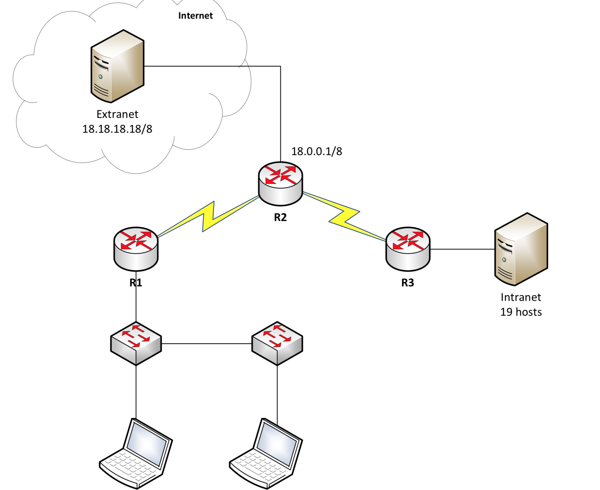

# Rip Protocol

## RIP protocol

het rip protocol laat connenctie maken van router naar router

```text
Configure terminal
router rip
version 2
network 10.0.0.0
no auto-summary
exit
```

> network kies je het grootste ip address in gebruik bv 10.0.0.0  
> no aut-summery wordt gebruikt om niet klassevol te moeten werken.

you will need to configure the following code if you need to go to a extranet

```text
redistribute static 
default-information originate
```





