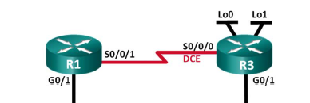
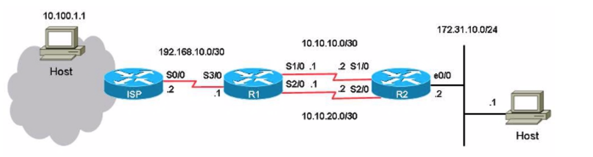

# Statisch



## Static Route Configurations

### Configure a recursive static route.

```text
R1(config)# ip route 192.168.1.0 255.255.255.0 10.1.1.2
R1(config)# ip route <IP Adress network R3 G0/1> <subnet network R3 G0/1> <IP ADD S0/0/0>
```

### Configure a directly connected static route.

```text
R3(config)# ip route 192.168.0.0 255.255.255.0 s0/0/0
```

### Remove static routes.

```text
R1(config)# no ip route 209.165.200.224 255.255.255.224 serial0/0/1
R1(config)# no ip route 209.165.200.224 255.255.255.224 10.1.1.2
R1(config)# no ip route 209.165.200.224 255.255.255.224
```



R1

```text
hostname R1

interface Serial1/0
ip address 10.10.10.1 255.255.255.252

interface Serial2/0
ip address 10.10.20.1 255.255.255.252

ip route 10.0.0.0 255.0.0.0 192.168.10.2
 
! This is the primary route to get to hosts on the Internet.

ip route 172.31.10.0 255.255.255.0 10.10.10.2
 
! This is the preferred route to the LAN.
 
ip route 172.31.10.0 255.255.255.0 10.10.20.2 250
 
! This is the floating static route to the LAN.

```

This is the configuration on R2:

```text
hostname R2
!
interface Serial1/0
 ip address 10.10.10.2 255.255.255.252
!
interface Serial2/0
 ip address 10.10.20.2 255.255.255.252
!
ip route 0.0.0.0 0.0.0.0 10.10.10.1
ip route 0.0.0.0 0.0.0.0 10.10.20.1 250
!

```

