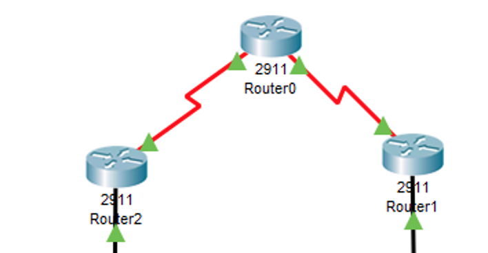

# Statisch

## 



## Statiche routering

Router2

```text
ip route 0.0.0.0 0.0.0.0 S0/0/0  //stuur alles wat je niet kent naar S0/0/0
```

Router0

```text
ip route 172.16.0.0 255.255.248.0 Serial0/0/0    //network to router2
ip route 192.168.0.0 255.255.255.224 Serial0/0/1 //network to router1
```

Router1

```text
ip route 0.0.0.0 0.0.0.0 S0/0/1
```

