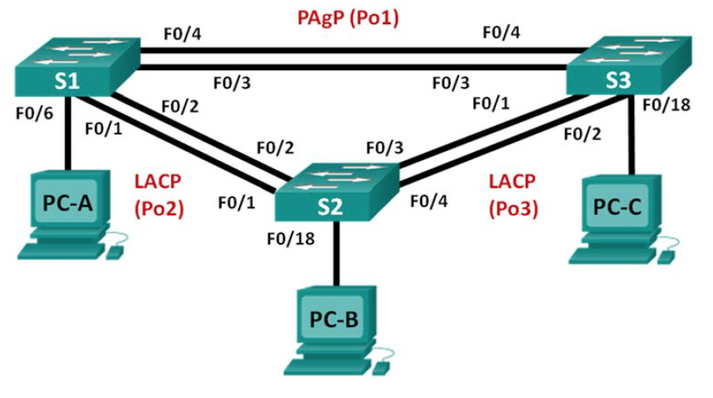

# Switch

## configuring basis settings

Becoming a super hero is a fairly straight forward process:

```text
Enable
Configure terminal
Hostname S1
no ip domain-lookup
service password-encryption
enable secret admin
banner motd #
Unauthorized access is strictly prohibited. #
line con 0
password admin
login
logging synchronous
line vty 0 15
transport input ssh 
exec-timeout 5 0 
password admin
logging synchronous
login
exit
```

> Password: admin

`show running config`

## Configure ip address 

```text
Configure terminal
interface vlan <number Vlan>
ip address <ip addres> <subnet>
no shutdown
ip default-gateway <default-gateway>
exit
```

## Assaning Vlan

```text
Configure terminal
vlan 10
name Students
vlan 20
name Faculty
```

### trunk or acces

```text
interface g0/2
switchport mode trunk 
switchport trunk native vlan 99
interface g0/1
switchport mode trunk
interface f0/1
switchport mode access
switchport access vlan 20
```

> vlan 99 = administarters vlan  
> native vlan wordt toegekend op drukste vlan, dit om CPU kracht te besparen.

> Switchport mode **trunk** wordt gebruikt van **switch** naar **switch**  
> Switchport mode **acces** wordt gebruikt van **switch** naar **pc**

Use the **`show vlan brief`** command on all switches to verify that all VLANs are registered in the VLAN table and that the correct ports are assigned.  
Use the **`show interfaces trunk`** command on all switches to verify trunk interfaces.  
Use the **`show running-config`** command on all switches to verify all other configurations.

## CCNA 3

## spanning tree

root switch

```text
spanning-tree vlan 1,10,99 root primary
spanning-tree mode rapid-pvst
```

secondary switch

```text
spanning-tree vlan 1,10,99 root secondary
spanning-tree mode rapid-pvst
```

op een interface gekoppeld aan pc

```text
interface <interface>
spanning-tree portfast
spanning-tree bpduguard enable
```

> show spanning-tree

## Configuring EtherChannel



### Configure PAgP

on S1

```text
interface range f0/3-4`
channel-group 1 mode desirable
no shutdown
```

On S3

```text
interface range f0/3-4`
channel-group 1 mode auto
no shutdown
```

> show etherchannel summary

configure trunk ports on both switches

```text
interface port-channel 1
switchport mode trunk
switchport trunk native vlan 99
no shutdown
```

### configure LACP

on s1

```text
interface range f0/1-2
switchport mode trunk
switchport trunk native vlan 99
channel-group 2 mode active
no shutdown
```

on S2

```text
interface range f0/1-2
switchport mode trunk
switchport trunk native vlan 99
channel-group 2 mode passive
no shutdown
```


geindigt op 4.2.1.4


## Convigure VTP

All the switches will be configured to use VTP for VLAN updates. S2 will be configured as the server.Switches S1 and S3 will be configure as clients. They will be in the CCNA VTP domain using the password **admin**.

on the administrator

```text
Configure terminal
vtp domain CCNA
vtp mode server
vtp password admin
```

on the clients

```text
Configure terminal
vtp domain CCNA
vtp mode client
vtp password admin
```

> Verify VTP configurations by entering the `show vtp status` command on all switches.

## Configure DTP

dynamic trunk protocol. Anter following code on 


