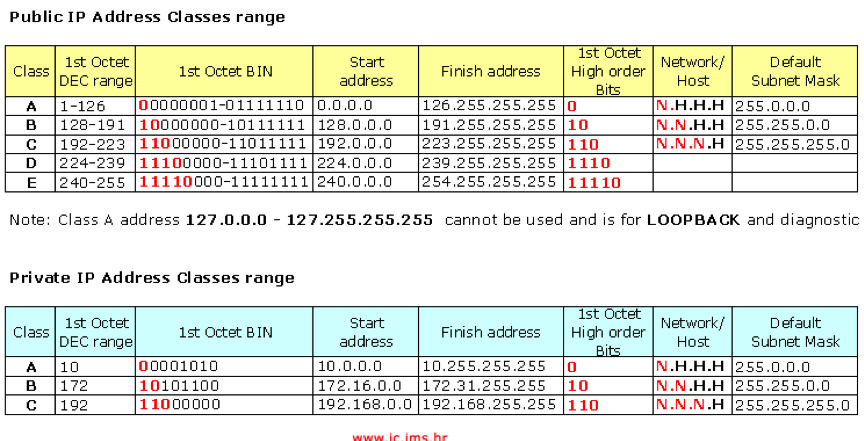

# Ip addressing

example of a adressing table

| **Device** | **Interface** | **Ip Address** | **Subnet Mask** | **Default Gateway** |
| :--- | :--- | :--- | :--- | :--- |
| **R1** | G0/0 | No shut |   |   |
|  **** | G0/0.10 studenen | 10.0.3.254 | 255.225.252.0 |   |
|  **** | G0/0.20 docenten | 10.0.4.254 | 255.225.255.0 |   |
|  **** | S0/0/0/0 | 10.0.5.37 | 255.255.255.252 |   |
| **R2** | S0/0/0/0 | 10.0.5.38 | 255.255.255.252 |   |
|  **** | S0/0/0/1 | 10.0.5.33 | 255.255.255.252 |   |
|  **** | G0/0 | 18.0.0.1 | 225.0.0.0 |   |
| **R3** | S0/0/0/1 | 10.0.5.34 | 255.255.255.252 |   |
|  **** | G0/0 | 10.0.5.30 | 255.255.255.224 |   |
| **S1** | VLAN 20 | 10.0.4.253 | 255.225.252.0 | 10.0.4.254 |
| **S2** | VLAN 20 | 10.0.4.252 | 255.255.255.0 | 10.0.4.254 |
| **PC-A** | NIC | 10.0.0.1 | 255.225.255.0 | 10.0.3.254 |
| **PC-B** | NIC | 10.0.4.1 | 255.255.255.0 | 10.0.4.254 |
| **Intranet** | NIC | 10.0.5.1 | 225.225.255.224 | 10.0.5.30 |
| **Extranet** | NIC | 18.18.18.18 | 225.0.0.0 |   |

Default gateway = broadcast -1

Ip addres van G0/0.10 is default gateway van vlan studenten

## Ip adressen berekenen.




ip adresses worden gerangschikt van **groot** naar **klein**


